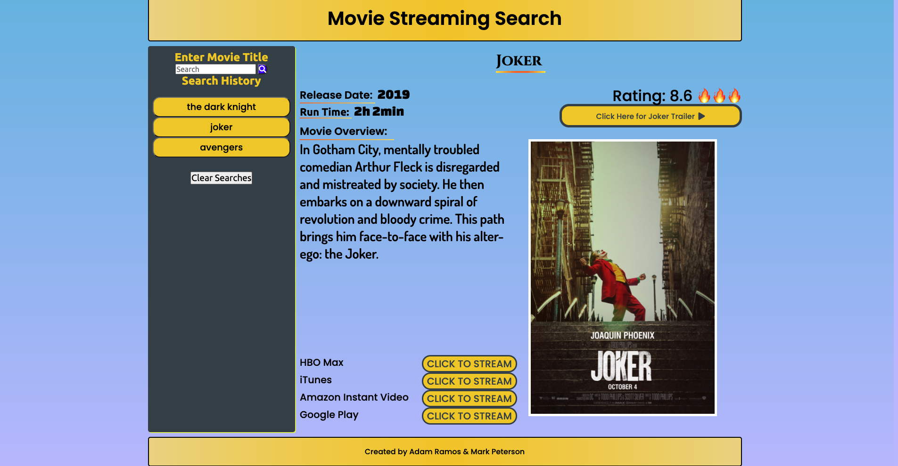

# Movie Database Search
# Movie Database Search

## Deployed Link
[Movie Database Search](https://PLACEHOLDER_URL)

## Description
### Create a movie database that provides basic info & where to stream

## Tasks
* Create a website that utilizes at least two API's (IMDB & Utelly)
* Use a styling framework other than Bootstrap
    * Used CSS Grid

## Features
* Searches are saved locally
* Searches can be removed (local storage)
* Link to watch trailer
* Movie poster is populated
* Where to stream with links

## Screenshot (click screenshot to be directed to deployed link)

### Current Version
V1.0